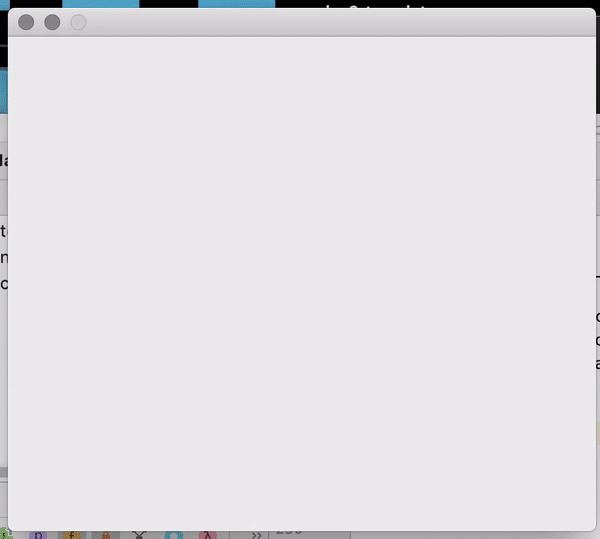

# Operating Systems - CS307 

###Fall 2020

The following pages contain all source code for homeworks, software development and project implementation.

Each project contains brief overview & explanation in source code file. Detailed explanation in PDF file. 

1. ### Homework 1:

Airline Reservation System, shared resources, POSIX Threads, busy waiting. 

#### Sample Output

2. ### Homework 2:

Dining Philosophers Problem, Barriers/Cyclic Barriers, Java, Semaphores & Mutexes (check video sample run). 

#### Sample Run

3. ### Homework 3:

Memory Management API, Shared memory & queue, multi-threads. 

#### Sample Output

4. ### Homework 4:

Memory Mapping & File Reading, fstream/istream/mmap, Speed & Performance Comparison (sample loremipsum.txt uploaded due to size limit). 

#### Sample Output

